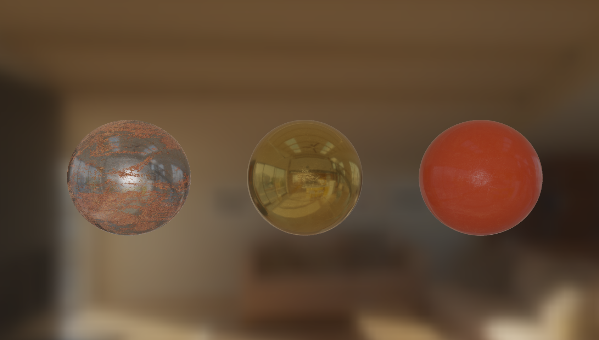

softRenderer

* 2D line rasterization
  * Bresenham algorithm
  * Wu's line algorithm
* 2D triangle rasterization
  * line equation method
  * barycentric method
* 3D triangle rasterization
  * MVP transformation
  * clip & tessellation
  * perspective division, viewport transform
  * back-face culling
  * z buffer
  * top-left rule
  * polygon mode
  * perspective correct interpolation
* lighting
  * programmable shader
  * texture mapping
  * (Blinn-)Phong lighting model
  * normal mapping
  * skybox
  * shadow mapping
* PBR
* IBL
* SSAA
* model loading
* Catmull-Clark subdivision with half-edge
* multi-thread parallel optimization

image based lighting:

model loading and lighting model:

shadow mapping with PCF:

Catmull-Clark subdivision with half-edge:

